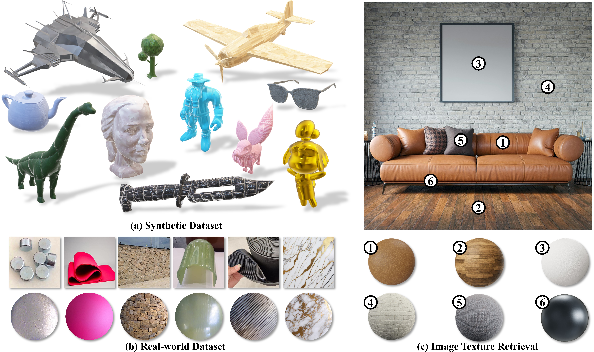

<div align="center">
  <h1>MaRI: Material Retrieval Integration across Domains</h1>
  <p>
    [**Jianhui Wang**](#)<sup>1</sup> · 
    [**Zhifei Yang**](#)<sup>2</sup> · 
    [**Yangfan He**](#)<sup>3</sup> · 
    [**Huixiong Zhang**](#)<sup>1</sup> · 
    [**Yuxuan Chen**](#)<sup>4</sup> · 
    [**Jingwei Huang**](#)<sup>5✉</sup>
  </p>
  <p>
    <sup>1</sup>University of Electronic Science and Technology of China · 
    <sup>2</sup>Peking University · 
    <sup>3</sup>University of Minnesota · 
    <sup>4</sup>Fudan University · 
    <sup>5</sup>Tencent Hunyuan3D
  </p>
  <table class="center">
    <tr>
      <td width="100%" style="border: none">
        
      </td>
    </tr>
  </table>
</div>

## Text-to-Image Generation

### 1. Set Environment
```bash
conda env create -f environment.yml
conda activate MaRI
