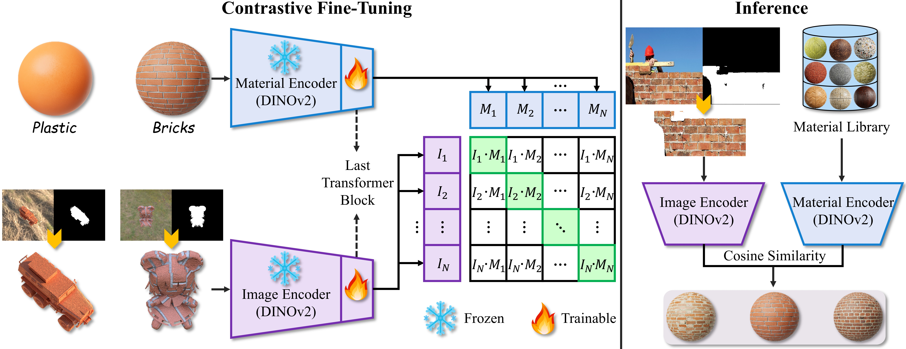

<h1 align="center">MaRI: Material Retrieval Integration across Domains</h1>

<div align="center">

[](https://jianhuiwemi.github.io/MaRI)
[](https://arxiv.org/abs/2503.08111)
[](https://cvpr.thecvf.com/virtual/2025/poster/34069)
<a href="https://huggingface.co/datasets/jianhuiwemi/MaRI">
  
</a>
[](https://opensource.org/licenses/MIT)

</div>

<p align="center">
  
</p>
---


</div>

## 📥 Dataset Construction Pipeline
We provide detailed pipeline instructions and related explanations in two files: [Synthetic Data](./dataset/synthetic/readme.md) and [Real-world Data](./dataset/real/readme.md). Please refer to each for more information.

## ⚙ Fine-tune
Create and activate the Conda environment:
```bash
conda env create -f environment.yml
conda activate MaRI
```
We provide training scripts in `train/stage1.py` and `train/stage2.py`. You can run them using:
```bash
python train/stage-1.py  # Fine-tune on large-scale synthetic data
```
We found that fine-tuning on large-scale synthetic data for just one epoch yields the best performance. Then, we perform a second-stage fine-tuning on real-world data with a lower learning rate:
```bash
python train/stage-2.py  # Fine-tune on real-world data
```

## ⭐ Inference

Download the pre-trained model weights from [this link](https://drive.google.com/file/d/1rlHUrPDShA_w1OmJF8Eeo-SMX_-CJaGD/view?usp=drive_link). Then, modify paths in `inference.py` as needed. Simply run:
```bash
python inference.py
```
We also provide a simple tool that allows users to mark regions of interest in the input image. You can try it using `tool.py`.

## 🎯TODO

We plan to organize and release our dataset as open-source in the near future.


## 📝 Citation
If you find our work useful for your research or applications, please cite using this BibTeX:
```bibtex
@misc{wang2025marimaterialretrievalintegration,
      title={MaRI: Material Retrieval Integration across Domains}, 
      author={Jianhui Wang and Zhifei Yang and Yangfan He and Huixiong Zhang and Yuxuan Chen and Jingwei Huang},
      year={2025},
      eprint={2503.08111},
      archivePrefix={arXiv},
      primaryClass={cs.CV},
      url={https://arxiv.org/abs/2503.08111}, 
}
```

## 💐 Acknowledgements
We gratefully acknowledge the following resources and communities that made this work possible:
- [DINOv2](https://github.com/facebookresearch/dinov2) for the powerful pre-trained vision models.
- [Objaverse](https://objaverse.allenai.org) for providing a diverse collection of 3D models.
- [AmbientCG](https://ambientcg.com) for high-quality material textures.
- [HDRI Haven](https://polyhaven.com/hdris) for the free high-dynamic-range images used in our lighting setups.
